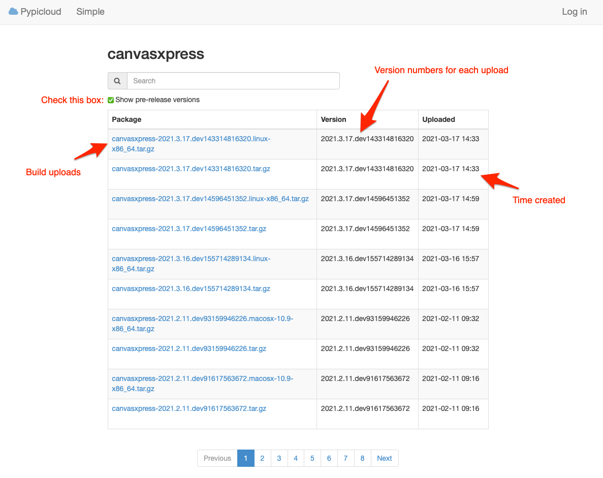

# CanvasXpress Python Library

<a href="https://www.canvasxpress.org">
</a>

<!-- Badge Location -->
Bagdes TBD
<!-- End Badges -->

***This package is late alpha / early beta in maturity.  Functionality will be completed quickly over spring 2021, and
until completed the API will be subject to change without warning.  Thank you for your patience, and please check back
often for updates!***

***canvasXpress*** was developed as the core visualization component for bioinformatics and systems biology analysis
at Bristol-Myers Squibb. It supports a large number of [visualizations ](https://www.canvasxpress.org/examples.html) 
to display scientific and non-scientific data. ***canvasXpress*** also includes a simple and unobtrusive
[user interface](https://www.canvasxpress.org/docs/interface.html) to explore complex data sets, a sophisticated and
unique mechanism to keep track of all user customization for
[Reproducible Research ](https://www.canvasxpress.org/docs/audit.html) purposes, as well as an 'out of the box'
broadcasting capability to synchronize selected data points in all ***canvasXpress*** plots in a page. Data can
be easily sorted, grouped, transposed, transformed or clustered dynamically. The fully customizable mouse events
as well as the zooming, panning and drag-and-drop capabilities are features that make this library unique in its
class.

***canvasXpress*** can be now simply used within Python at the console to generate conventional plots; in an IDE;
or seamlessly embedded in applications, such as:
* [Jupyter](https://jupyter.org/)
* [flask](https://flask.palletsprojects.com/en/1.1.x/)
* [Django](https://www.djangoproject.com/)

Full-fledged examples of the ***canvasXpress*** library including the mouse events, zooming, and broadcasting
capabilities are included in this package in several examples.  This ***canvasXpress*** Python package was
created by [Aggregate Genius Inc.](https://www.aggregate-genius.com) in cooperation with the ***canvasXpress***
team.

The maintainer of the Python edition of this package is [Dr. Todd C. Brett](https://github.com/docinfosci).

### Roadmap

This package will evolve quickly over spring 2021, with the following enhancements anticipated:
* Completion of the API
* Comprehensive documentation for the API
* Comprehensive automated tests for the API
* Examples illustrating API use
* Tutorial for Flask-style applications
* Tutorial for Jupyter Notebooks
* Third party contributor guidelines
* Publication to PyPI.org the 1.0 package
* Updates to this ReadMe

### Installation

To install the `canvasxpress` package the `pip` system can be used.

Manual execution of `pip`:

    pip install canvasxpress

Or via a `requirements.txt` file.  Standard `pip` parameters for package
version specification, upgrade, etc. work as expected.

#### Temporary Instructions for Pre-Release Packages

Until publication on PyPI, `pip` will need to know about the AG PyPI server in 
order to locate the package.  This can be performed using a profile—see _Config file_ at:

https://pip.pypa.io/en/stable/user_guide/

An index is where `pip` searches for packages, and an extra index must be specified.  
An example that permits both the private and public PyPI hosts to be used is:

    pip3 install --pre --extra-index-url https://tools-prd.aggregate-genius.com/python-packages/simple 'canvasxpress==version'

pip requires that development versions be explicity stated, such as `'canvasxpress==2021.3.17.dev143314816320'`.

Jupyter supports package installation via the sys package:

```python
# Import canvasxpress into the current IPython workspace.  canvasxpress is not installed by default at this time.
import sys
!{sys.executable} -m pip install --pre --upgrade --force-reinstall --extra-index-url https://tools-prd.aggregate-genius.com/python-packages/simple/ "canvasxpress==version"
    
# Once public in PyPI, if not pre-installed by admins:
!{sys.executable} -m pip install -U canvasxpress
```

*development* or *pre-release* editions of the canvasxpress package are created
with each code commit and deployed to the Aggregate Genius Inc. PyPI server.
Visit the following URL to see a list of canvasxpress package editions and 
their versions:

https://tools-prd.aggregate-genius.com/python-packages/#/package/canvasxpress

<a href="https://tools-prd.aggregate-genius.com/python-packages/#/package/canvasxpress">
</a>

### Examples

These are included to get you started on basic charting - there are many more
examples (including complex and compound visualizations) with Python code 
~~available in the Examples section of the main website at 
[https://www.canvasxpress.org](https://www.canvasxpress.org)~~

### Test Examples

This package is validated and verified through the use of automated tests.  A functional test comparing Javascript and 
Python editions of a canvasXpress chart via a simple flask service is available at 
[Bar Chart Example](tests/functional/web/cx_example/bar).

The essential Python code is:
```python
from flask import render_template

from canvasxpress.config.type import CXGraphType, CXGraphTypeOptions
from canvasxpress.config.collection import CXConfigs
from canvasxpress.canvas import CanvasXpress
from canvasxpress.data.keypair import CXDictData

@app.route('/python')
    def get_canvasxpress_python_chart() -> str:
        """
        Renders a CanvasXpress example using Python that adapts a Javascript
        examples from the canvasxpress.org site.
        """
        chart: CanvasXpress = CanvasXpress(
            target_id="canvasId",
            data=CXDictData(data),
            config=CXConfigs(
                CXGraphType(CXGraphTypeOptions.Bar)
            )
        )

        html_parts = chart.render_to_html_parts()
        return render_template(
            "bar.html",
            canvas_element=html_parts["cx_canvas"],
            bar_graph=html_parts["cx_js"]
        )
```

### Jupyter Notebook Example

CanvasXpress for Python supports Jupyter Notebooks, with an example notebook provided in this project at 
[Jupyter Example](examples/jupyter/demo.ipynb).

The essential Python code is:

```python
from canvasxpress.canvas import CanvasXpress
from canvasxpress.config.collection import CXConfigs
from canvasxpress.config.type import CXGraphType, CXGraphTypeOptions, CXString, CXBool, CXList
from canvasxpress.data.keypair import CXDictData
from canvasxpress.js.collection import CXEvents
from canvasxpress.js.function import CXEvent
from canvasxpress.render.jupyter import CXNoteBook

# =====
# Example converted from https://canvasxpress.org/examples
# =====

# Dictionary data is used here.  This could also have been JSON in string
# form via CXJSONData
chart_data = CXDictData(raw_data)

# A chart configuration is managed distinct from the associated chart, and it
# can be reused across multiple chart objects.  A CXConfig object can be
# initialized with a set of CXType objects or, later, objects can be added via
# add() or set_param().  These functions support chaining.
chart_configs = CXConfigs(
    CXGraphType(CXGraphTypeOptions.Scatter2D),
    CXString("axisAlgorithm", "rPretty"),
    CXString("backgroundType", "window"),
    CXString("backgroundWindow", "rgb(238,238,238)"),
    CXString("colorBy", "Group"),
    CXList("colors", ["rgba(0,104,139,0.5)","rgba(205,0,0,0.5)","rgba(64,64,64,0.5)"]),
    CXBool("showTransition", False),
    CXString("theme", "CanvasXpress"),
    CXString("showLoessFit", True),
    CXBool("legendBox", True),
    CXString("legendBoxColor", "rgb(0,0,0)"),
    CXBool("legendInside", True),
    CXString("legendPosition", "bottomRight"),
    CXBool("showConfidenceIntervals", False),
    CXBool("showDecorations", True),
    CXBool("showTransition", False),
    CXString(
        "title", 
        "Average weekly household spending, in British pounds, on tobacco products"
        "\\nand alcoholic beverages for each of the 11 regions of Great Britain."
    ),
    CXList("xAxis", ["Alcohol"]),
    CXList("yAxis", ["Tobacco"]),
)

# Continued configuration via add().
chart_configs.add(CXList("sizes", [4,14,16,18]))

# Continued configuration via set_param().
chart_configs \
    .set_param("sizeBy", "FC") \
    .set_param("plotBox", False)

# An example event showing some information as the mouse moves
chart_events = CXEvents(
    CXEvent(
        "click",
        """
        var s = 'click on var ' + o.y.vars[0] + ' and smp ' + o.y.smps[0];
        t.showInfoSpan(e, s);
        """
    )
)

# The canvas, which uses earlier work
chart = CanvasXpress(
    target_id="example_scatter2d",
    data=chart_data,
    config=chart_configs,
    events=chart_events
)

# Jupyter notebook requires components to render in their own containers -- so we provide one
demo_nb = CXNoteBook(chart)
demo_nb.render()
```


#### Scatter 3D Plot

TBD

#### Scatter 2D Matrix Plot

TBD

#### Boxplot

TBD

#### Heatmap (Multi-dimensional)

TBD

#### Four way Venn Diagram

TBD

### More Examples and Resources

TBD

There is also a wealth of additional information including full API documentation 
and extensive R and JavaScript examples at [https://www.canvasxpress.org](https://www.canvasxpress.org).
